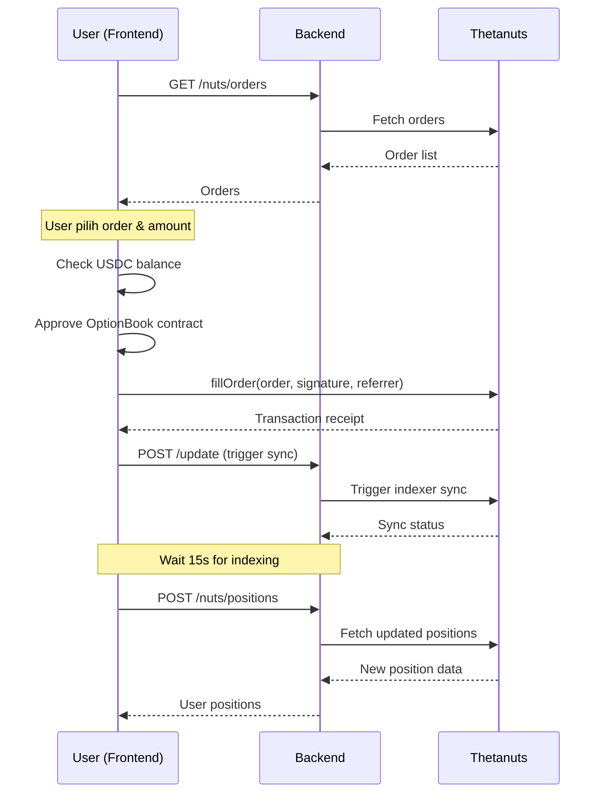

# Analisis Integrasi Thetanuts V4 - Alphabit Backend

## Ringkasan Temuan

Setelah menganalisis proyek backend Alphabit dan dokumentasi Thetanuts V4, berikut adalah temuan, gap, dan rekomendasi saya.

---

## 📊 Status Implementasi Saat Ini

### Yang Sudah Ada ✅

| Komponen | Status | Detail |
|----------|--------|--------|
| Proxy untuk Orders | ✅ | `GET /nuts/orders` → Thetanuts API |
| Proxy untuk Positions | ✅ | `POST /nuts/positions` (open/history/all) |
| Proxy untuk Update | ✅ | `GET /nuts/update` |
| Proxy untuk Stats | ✅ | `GET /nuts/stats` |
| Swagger Documentation | ✅ | OpenAPI specs di `docs/nuts.ts` |
| User Model | ✅ | Prisma schema dengan Farcaster profile |

### Gap yang Ditemukan ⚠️

| Komponen | Status | Dampak |
|----------|--------|--------|
| Referrer Address | ❌ Belum ada | Tidak bisa track transaksi dari platform |
| Trade Execution | ❌ Belum ada | Tidak ada endpoint untuk `fillOrder()` |
| Transaction History DB | ❌ Belum ada | Tidak ada penyimpanan lokal transaksi |
| Payout Calculation | ❌ Belum ada | Tidak ada helper untuk hitung payout |
| Post-Trade Sync | ❌ Belum ada | Tidak ada trigger `/update` setelah trade |

---

## 🔍 Analisis Mendalam

### 1. Referrer Address (Critical)

> [!IMPORTANT]
> Menurut dokumentasi Thetanuts, `referrer` adalah parameter KRITIS untuk integrasi builder.

**Dari dokumentasi:**
```javascript
const YOUR_REFERRER = '0x...'; // unique address for your platform
await book.fillOrder(orderParams, orderData.signature, YOUR_REFERRER);
```

**Manfaat referrer:**
- **Tracking** → Tag semua positions yang dibuat via platform Alphabit
- **Filtering** → Filter positions user berdasarkan referrer untuk portfolio view
- **Fee Revenue** → Track referral fees di event `OrderFilled`

**Rekomendasi:**
1. Buat dedicated wallet address sebagai `ALPHABIT_REFERRER`
2. Simpan di environment variable
3. Gunakan saat execute trade di frontend

---

### 2. Trade Execution Flow

**Current State:** Backend hanya proxy untuk read data, tidak ada execution support.

**Yang Dibutuhkan Menurut Docs:**



**Insight:** 
- Trade execution HARUS dilakukan di **frontend** karena butuh wallet signature
- Backend bisa bantu dengan:
  - Order preparation/validation
  - ABI constants
  - Post-trade sync trigger
  - Position caching

---

### 3. Apakah Transaction History Perlu Disimpan di DB?

> [!TIP]
> Ini adalah pertanyaan penting dengan trade-off yang perlu dipertimbangkan.

#### Opsi A: TIDAK Simpan di DB (Current State)

| Pro | Kontra |
|-----|--------|
| Simple, data selalu fresh dari source | Bergantung 100% pada Thetanuts API |
| Tidak perlu sync/maintain | Tidak bisa custom analytics |
| Tidak ada data stale | Latency tinggi untuk aggregasi |
| GDPR friendly (no personal trading data) | Tidak bisa track offline |

#### Opsi B: SIMPAN di DB

| Pro | Kontra |
|-----|--------|
| Fast queries untuk dashboard user | Data bisa stale |
| Custom analytics & reporting | Perlu sync mechanism |
| Offline access ke history | Storage & maintenance cost |
| Leaderboard calculations | Potential data inconsistency |

#### ⭐ Rekomendasi Saya

**Untuk MVP/V1: TIDAK perlu simpan di DB**

Alasan:
1. Thetanuts indexer sudah menyediakan semua data yang dibutuhkan
2. Dengan filter referrer, Anda bisa get "your" positions dengan mudah
3. Menghindari kompleksitas sync dan data staleness
4. Caching di Redis/memory lebih cocok daripada DB persistence

**Untuk V2 (setelah MVP):** Pertimbangkan menyimpan jika:
- Butuh custom analytics (trading volume per user, leaderboard)
- Butuh historical data analysis
- Thetanuts API punya rate limits yang mengganggu

---

## 🛠️ Rekomendasi Teknis

### 1. Environment Variables (Tambahan)

```env
# Thetanuts Integration
ALPHABIT_REFERRER_ADDRESS=0x...  # Platform referrer address
THETANUTS_OPTIONBOOK_ADDRESS=0xd58b814C7Ce700f251722b5555e25aE0fa8169A1
THETANUTS_INDEXER_URL=https://optionbook-indexer.thetanuts.finance/api/v1
```

### 2. Endpoint Improvements

| Endpoint | Improvement |
|----------|-------------|
| `POST /nuts/positions` | Tambah filter by referrer secara default |
| `GET /nuts/update` | Jadikan `POST` untuk consistency dengan docs |
| Baru: `GET /nuts/config` | Return contract addresses, ABI, referrer |

### 3. Caching Strategy

```
Orders: Cache 30 detik (sesuai docs polling interval)
Positions: Cache 1-5 menit (less volatile)
Stats: Cache 5 menit
```

### 4. Schema Addition (Optional untuk V2)

```prisma
model TradeActivity {
  id              String   @id @default(cuid())
  userId          String
  user            User     @relation(fields: [userId], references: [id])
  
  optionAddress   String   // Deployed option contract
  txHash          String   @unique
  type            String   // "OPEN" | "SETTLED"
  
  // Order details
  underlyingAsset String   // "BTC" | "ETH"
  optionType      String   // "CALL_SPREAD" | "PUT_FLY" etc
  strikes         Json     // Array of strike prices
  expiry          DateTime
  
  // Financial
  premium         Decimal
  numContracts    Decimal
  collateral      Decimal
  payout          Decimal? // Only for settled
  
  createdAt       DateTime @default(now())
  settledAt       DateTime?
  
  @@index([userId, createdAt])
  @@map("trade_activities")
}
```

---

## 📋 Action Items Detail

### Priority 1 (Must Have) 🔴

#### 1.1 Definisikan `ALPHABIT_REFERRER_ADDRESS`

**Penjelasan:**
Referrer address adalah wallet address unik yang mengidentifikasi platform Alphabit di Thetanuts. Setiap trade yang dilakukan melalui platform akan di-tag dengan address ini.

**Langkah Implementasi:**
```bash
# 1. Buat wallet baru khusus untuk referrer (JANGAN gunakan wallet operasional)
#    Bisa pakai MetaMask, generate new wallet

# 2. Simpan address di .env
ALPHABIT_REFERRER_ADDRESS=0xYourNewWalletAddressHere

# 3. Simpan private key di tempat aman (untuk claim fees nanti)
```

**Tambahkan di `src/config/env.ts`:**
```typescript
export const env = {
  // ... existing config
  ALPHABIT_REFERRER_ADDRESS: process.env.ALPHABIT_REFERRER_ADDRESS || '',
  THETANUTS_OPTIONBOOK_ADDRESS: process.env.THETANUTS_OPTIONBOOK_ADDRESS || '0xd58b814C7Ce700f251722b5555e25aE0fa8169A1',
};
```

---

#### 1.2 Update Frontend untuk Pass Referrer ke `fillOrder()`

**Penjelasan:**
Saat user execute trade di frontend, referrer address harus di-pass sebagai parameter ke-3 pada fungsi `fillOrder()`.

**Contoh Implementasi Frontend:**
```typescript
// constants/thetanuts.ts
export const ALPHABIT_REFERRER = '0xYourReferrerAddress';
export const OPTION_BOOK_ADDRESS = '0xd58b814C7Ce700f251722b5555e25aE0fa8169A1';

// hooks/useTrade.ts
import { useWriteContract } from 'wagmi';
import { OPTION_BOOK_ABI } from '../constants/abi';

export function useFillOrder() {
  const { writeContract } = useWriteContract();

  const fillOrder = async (orderData: OrderData, usdcAmount: bigint) => {
    // Prepare order params (DO NOT modify any fields!)
    const orderParams = {
      maker: orderData.order.maker,
      orderExpiryTimestamp: orderData.order.orderExpiryTimestamp,
      collateral: orderData.order.collateral,
      isCall: orderData.order.isCall,
      priceFeed: orderData.order.priceFeed,
      implementation: orderData.order.implementation,
      isLong: orderData.order.isLong,
      maxCollateralUsable: orderData.order.maxCollateralUsable,
      strikes: orderData.order.strikes,
      expiry: orderData.order.expiry,
      price: orderData.order.price,
      extraOptionData: orderData.order.extraOptionData || '0x',
      numContracts: calculateNumContracts(usdcAmount, orderData.order.price),
    };

    // Execute trade dengan ALPHABIT_REFERRER
    return writeContract({
      address: OPTION_BOOK_ADDRESS,
      abi: OPTION_BOOK_ABI,
      functionName: 'fillOrder',
      args: [orderParams, orderData.signature, ALPHABIT_REFERRER], // <-- referrer di sini!
    });
  };

  return { fillOrder };
}
```

---

#### 1.3 Implementasi Referrer Filtering di Backend Positions Endpoint

**Penjelasan:**
Filter positions dari Thetanuts API berdasarkan referrer address untuk hanya menampilkan transaksi yang dibuat via Alphabit.

**File:** `src/controllers/nutsController.ts`

**Perubahan yang Diperlukan:**
```typescript
import { env } from '../config/env';

// Update getPositions method
getPositions: async (req: Request, res: Response) => {
  try {
    const { address, type, filterByReferrer = true } = req.body;
    
    // ... existing validation ...

    const response = await fetch(url);
    const data = await response.json();

    // Filter by Alphabit referrer jika diminta
    if (filterByReferrer && env.ALPHABIT_REFERRER_ADDRESS && Array.isArray(data)) {
      const filteredData = data.filter(
        (position: any) => 
          position.referrer?.toLowerCase() === env.ALPHABIT_REFERRER_ADDRESS.toLowerCase()
      );
      return res.status(200).json(filteredData);
    }

    res.status(200).json(data);
  } catch (error) {
    // ... error handling ...
  }
},
```

---

### Priority 2 (Should Have) 🟡

#### 2.1 Tambah Caching Layer (Redis/Memory)

**Penjelasan:**
Caching mengurangi load ke Thetanuts API dan meningkatkan response time. Untuk MVP, gunakan in-memory cache. Untuk production, gunakan Redis.

**Opsi A: In-Memory Cache (Simple)**

**Install dependency:**
```bash
npm install node-cache
```

**Buat file:** `src/lib/cache.ts`
```typescript
import NodeCache from 'node-cache';

// TTL dalam detik
const cache = new NodeCache({
  stdTTL: 30,           // Default 30 detik
  checkperiod: 60,      // Check expired setiap 60 detik
  useClones: false,     // Performance optimization
});

export const cacheKeys = {
  ORDERS: 'thetanuts:orders',
  STATS: 'thetanuts:stats',
  POSITIONS: (address: string) => `thetanuts:positions:${address}`,
  HISTORY: (address: string) => `thetanuts:history:${address}`,
};

export const cacheTTL = {
  ORDERS: 30,      // 30 detik (sesuai docs polling)
  POSITIONS: 60,   // 1 menit
  HISTORY: 300,    // 5 menit  
  STATS: 300,      // 5 menit
};

export { cache };
```

**Update controller dengan caching:**
```typescript
import { cache, cacheKeys, cacheTTL } from '../lib/cache';

getOrders: async (req: Request, res: Response) => {
  try {
    // Check cache first
    const cached = cache.get(cacheKeys.ORDERS);
    if (cached) {
      return res.status(200).json(cached);
    }

    // Fetch from API
    const response = await fetch('https://round-snowflake-9c31.devops-118.workers.dev/');
    const data = await response.json();

    // Store in cache
    cache.set(cacheKeys.ORDERS, data, cacheTTL.ORDERS);

    res.status(200).json(data);
  } catch (error) {
    // ... error handling
  }
},
```

**Opsi B: Redis Cache (Production)**

```bash
npm install ioredis
```

```typescript
// src/lib/redis.ts
import Redis from 'ioredis';

const redis = new Redis(process.env.REDIS_URL);

export async function getWithCache<T>(
  key: string, 
  fetchFn: () => Promise<T>, 
  ttlSeconds: number
): Promise<T> {
  const cached = await redis.get(key);
  if (cached) return JSON.parse(cached);

  const data = await fetchFn();
  await redis.setex(key, ttlSeconds, JSON.stringify(data));
  return data;
}
```

---

#### 2.2 Tambah Endpoint `GET /nuts/config`

**Penjelasan:**
Endpoint ini memberikan frontend semua konfigurasi yang dibutuhkan untuk berinteraksi dengan Thetanuts, termasuk contract addresses, ABI, dan referrer.

**Buat file:** `src/config/thetanutsConfig.ts`
```typescript
export const OPTION_BOOK_ABI = [
  {
    inputs: [
      { components: [
        { internalType: "address", name: "maker", type: "address" },
        { internalType: "uint256", name: "orderExpiryTimestamp", type: "uint256" },
        { internalType: "address", name: "collateral", type: "address" },
        { internalType: "bool", name: "isCall", type: "bool" },
        { internalType: "address", name: "priceFeed", type: "address" },
        { internalType: "address", name: "implementation", type: "address" },
        { internalType: "bool", name: "isLong", type: "bool" },
        { internalType: "uint256", name: "maxCollateralUsable", type: "uint256" },
        { internalType: "uint256[]", name: "strikes", type: "uint256[]" },
        { internalType: "uint256", name: "expiry", type: "uint256" },
        { internalType: "uint256", name: "price", type: "uint256" },
        { internalType: "uint256", name: "numContracts", type: "uint256" },
        { internalType: "bytes", name: "extraOptionData", type: "bytes" },
      ], internalType: "struct OptionBook.Order", name: "order", type: "tuple" },
      { internalType: "bytes", name: "signature", type: "bytes" },
      { internalType: "address", name: "referrer", type: "address" },
    ],
    name: "fillOrder",
    outputs: [{ internalType: "address", name: "optionAddress", type: "address" }],
    stateMutability: "nonpayable",
    type: "function",
  },
];

export const ERC20_ABI = [
  {
    inputs: [
      { internalType: "address", name: "spender", type: "address" },
      { internalType: "uint256", name: "amount", type: "uint256" },
    ],
    name: "approve",
    outputs: [{ internalType: "bool", name: "", type: "bool" }],
    stateMutability: "nonpayable",
    type: "function",
  },
  {
    inputs: [
      { internalType: "address", name: "owner", type: "address" },
      { internalType: "address", name: "spender", type: "address" },
    ],
    name: "allowance",
    outputs: [{ internalType: "uint256", name: "", type: "uint256" }],
    stateMutability: "view",
    type: "function",
  },
];

export const CONTRACTS = {
  chainId: 8453and // Base Mainnet
  optionBook: '0xd58b814C7Ce700f251722b5555e25aE0fa8169A1',
  tokens: {
    USDC: '0x833589fCD6eDb6E08f4c7C32D4f71b54bdA02913',
    WETH: '0x4200000000000000000000000000000000000006',
    CBBTC: '0xcbB7C0000aB88B473b1f5aFd9ef808440eed33Bf',
  },
  priceFeeds: {
    BTC: '0x64c911996D3c6aC71f9b455B1E8E7266BcbD848F',
    ETH: '0x71041dddad3595F9CEd3DcCFBe3D1F4b0a16Bb70',
  },
  implementations: {
    CALL_SPREAD: '0x2Db5aFA04aeE616157Beb53b96612947b3d13eE3',
    PUT_SPREAD: '0x571471B2f823cC6B5683FC99ac6781209BC85F55',
    CALL_BUTTERFLY: '0xb727690FDD4Bb0ff74f2f0CC3E68297850A634c5',
    PUT_BUTTERFLY: '0x78b02119007F9EFc2297A9738b9a47A3bc3c2777',
    CALL_CONDOR: '0x7D3C622852d71B932D0903F973cafF45BCdBa4F1',
    PUT_CONDOR: '0x5cc960B56049b6f850730FacB4F3EB45417c7679',
    IRON_CONDOR: '0xb200253b68Fbf18f31D813AECEf97be3A6246b79',
  },
};
```

**Tambah di controller:**
```typescript
// In nutsController.ts
import { OPTION_BOOK_ABI, ERC20_ABI, CONTRACTS } from '../config/thetanutsConfig';

getConfig: async (req: Request, res: Response) => {
  res.status(200).json({
    success: true,
    data: {
      referrer: env.ALPHABIT_REFERRER_ADDRESS,
      contracts: CONTRACTS,
      abi: {
        optionBook: OPTION_BOOK_ABI,
        erc20: ERC20_ABI,
      },
    },
  });
},
```

**Tambah route:**
```typescript
// In routes/nuts.ts
router.get('/config', nutsController.getConfig);
```

---

#### 2.3 Error Handling yang Lebih Robust

**Penjelasan:**
Implementasi error handling yang consistent dengan error codes spesifik dan logging.

**Buat file:** `src/lib/errors.ts`
```typescript
export class ThetanutsApiError extends Error {
  constructor(
    message: string,
    public statusCode: number = 500,
    public code: string = 'THETANUTS_API_ERROR'
  ) {
    super(message);
    this.name = 'ThetanutsApiError';
  }
}

export const ErrorCodes = {
  FETCH_ORDERS_FAILED: 'FETCH_ORDERS_FAILED',
  FETCH_POSITIONS_FAILED: 'FETCH_POSITIONS_FAILED',
  INVALID_ADDRESS: 'INVALID_ADDRESS',
  INVALID_TYPE: 'INVALID_TYPE',
  EXTERNAL_API_ERROR: 'EXTERNAL_API_ERROR',
};
```

**Update controller dengan better error handling:**
```typescript
import { ThetanutsApiError, ErrorCodes } from '../lib/errors';

getOrders: async (req: Request, res: Response) => {
  try {
    const response = await fetch(ORDERS_URL);
    
    if (!response.ok) {
      throw new ThetanutsApiError(
        `Thetanuts API error: ${response.status}`,
        502,
        ErrorCodes.EXTERNAL_API_ERROR
      );
    }

    const data = await response.json();
    res.status(200).json({ success: true, data });
  } catch (error) {
    console.error('[NutsController] getOrders error:', error);
    
    if (error instanceof ThetanutsApiError) {
      return res.status(error.statusCode).json({
        success: false,
        error: {
          code: error.code,
          message: error.message,
        },
      });
    }

    res.status(500).json({
      success: false,
      error: {
        code: ErrorCodes.FETCH_ORDERS_FAILED,
        message: 'Failed to fetch orders',
      },
    });
  }
},
```

---

### Priority 3 (Nice to Have) 🟢

#### 3.1 Payout Calculation Helpers

**Penjelasan:**
Helper functions untuk menghitung potential payout dari options berdasarkan tipe (spread, butterfly, condor) dan harga settlement.

**Buat file:** `src/lib/payoutCalculator.ts`
```typescript
interface Order {
  strikes: string[];  // Array of strike prices (8 decimals)
  isCall: boolean;
  price: string;      // Premium price (8 decimals)
}

/**
 * Calculate max payout for bounded structures
 * Max Payout = Strike Width × Number of Contracts
 */
export function calculateMaxPayout(order: Order, numContracts: number): number {
  const strikes = order.strikes.map(s => Number(s) / 1e8);
  
  let strikeWidth: number;
  
  switch (strikes.length) {
    case 2: // Spread
      strikeWidth = Math.abs(strikes[1] - strikes[0]);
      break;
    case 3: // Butterfly
      strikeWidth = strikes[1] - strikes[0]; // symmetric
      break;
    case 4: // Condor
      strikeWidth = strikes[1] - strikes[0]; // simplified
      break;
    default:
      return 0;
  }
  
  return strikeWidth * numContracts;
}

/**
 * Calculate payout at a given settlement price
 */
export function calculatePayoutAtPrice(
  order: Order, 
  numContracts: number, 
  settlementPrice: number
): number {
  const K = order.strikes.map(s => Number(s) / 1e8);
  const S = settlementPrice;
  const isCall = order.isCall;

  // Spreads (2 strikes)
  if (K.length === 2) {
    const [L, U] = K;
    if (isCall) {
      if (S <= L) return 0;
      if (S >= U) return (U - L) * numContracts;
      return (S - L) * numContracts;
    } else {
      if (S >= U) return 0;
      if (S <= L) return (U - L) * numContracts;
      return (U - S) * numContracts;
    }
  }

  // Butterflies (3 strikes)
  if (K.length === 3) {
    const [L, M, U] = K;
    const w = M - L;
    if (S <= L || S >= U) return 0;
    if (S === M) return w * numContracts;
    return S < M 
      ? ((S - L) / w) * w * numContracts 
      : ((U - S) / w) * w * numContracts;
  }

  // Condors (4 strikes)
  if (K.length === 4) {
    const [K1, K2, K3, K4] = K;
    const max = (K2 - K1) * numContracts;
    if (S <= K1 || S >= K4) return 0;
    if (S >= K2 && S <= K3) return max;
    if (S < K2) return ((S - K1) / (K2 - K1)) * max;
    return ((K4 - S) / (K4 - K3)) * max;
  }

  return 0;
}

/**
 * Get option type label from strikes count and implementation
 */
export function getOptionTypeLabel(strikesCount: number, isCall: boolean): string {
  const direction = isCall ? 'CALL' : 'PUT';
  switch (strikesCount) {
    case 2: return `${direction}_SPREAD`;
    case 3: return `${direction}_BUTTERFLY`;
    case 4: return `${direction}_CONDOR`;
    default: return 'UNKNOWN';
  }
}

/**
 * Calculate break-even price for spreads
 */
export function calculateBreakeven(order: Order, numContracts: number): number | null {
  if (order.strikes.length !== 2) return null;
  
  const [lowerStrike, upperStrike] = order.strikes.map(s => Number(s) / 1e8);
  const premium = Number(order.price) / 1e8;
  const totalPremium = premium * numContracts;

  if (order.isCall) {
    return lowerStrike + totalPremium / numContracts;
  } else {
    return upperStrike - totalPremium / numContracts;
  }
}
```

**Tambah endpoint (optional):**
```typescript
// In nutsController.ts
calculatePayout: async (req: Request, res: Response) => {
  const { order, numContracts, settlementPrice } = req.body;

  const maxPayout = calculateMaxPayout(order, numContracts);
  const payoutAtPrice = settlementPrice 
    ? calculatePayoutAtPrice(order, numContracts, settlementPrice)
    : null;
  const breakeven = calculateBreakeven(order, numContracts);

  res.status(200).json({
    success: true,
    data: {
      maxPayout,
      payoutAtPrice,
      breakeven,
      optionType: getOptionTypeLabel(order.strikes.length, order.isCall),
    },
  });
},
```

---

#### 3.2 Trade History Model di DB (untuk Analytics)

**Penjelasan:**
Jika nanti butuh custom analytics, leaderboard, atau fitur yang memerlukan data trading yang persistent, implementasi model berikut di database.

**File:** `prisma/schema.prisma`
```prisma
model TradeActivity {
  id              String    @id @default(cuid())
  userId          String
  user            User      @relation(fields: [userId], references: [id])
  
  // Identifiers
  optionAddress   String    // Deployed option contract address
  txHash          String    @unique
  status          TradeStatus @default(OPEN)
  
  // Order details
  underlyingAsset String    // "BTC" | "ETH"
  optionType      String    // "CALL_SPREAD" | "PUT_BUTTERFLY" etc
  isCall          Boolean
  isLong          Boolean
  strikes         Json      // Array of strike prices
  expiryTimestamp DateTime
  
  // Financial data
  collateralToken String    // USDC address
  entryPremium    Decimal   @db.Decimal(20, 8)
  entryFeePaid    Decimal   @db.Decimal(20, 8)
  numContracts    Decimal   @db.Decimal(20, 8)
  collateralAmount Decimal  @db.Decimal(20, 8)
  
  // Settlement (only for settled)
  settlementPrice Decimal?  @db.Decimal(20, 8)
  payoutAmount    Decimal?  @db.Decimal(20, 8)
  pnl             Decimal?  @db.Decimal(20, 8)
  
  // Timestamps
  createdAt       DateTime  @default(now())
  settledAt       DateTime?
  
  @@index([userId, createdAt])
  @@index([status])
  @@index([optionAddress])
  @@map("trade_activities")
}

enum TradeStatus {
  OPEN
  SETTLED
  EXPIRED
}

// Update User model to add relation
model User {
  // ... existing fields ...
  trades TradeActivity[]
}
```

**Service untuk sync trades:**
```typescript
// src/services/tradeSync.ts
export async function syncUserTrades(userId: string, walletAddress: string) {
  // Fetch from Thetanuts API
  const positions = await fetchPositions(walletAddress);
  const history = await fetchHistory(walletAddress);

  // Filter by our referrer
  const ourPositions = [...positions, ...history].filter(
    p => p.referrer.toLowerCase() === env.ALPHABIT_REFERRER_ADDRESS.toLowerCase()
  );

  // Upsert to database
  for (const position of ourPositions) {
    await prisma.tradeActivity.upsert({
      where: { txHash: position.entryTxHash },
      create: mapPositionToTradeActivity(userId, position),
      update: mapPositionToTradeActivity(userId, position),
    });
  }
}
```

---

#### 3.3 WebSocket untuk Real-time Position Updates

**Penjelasan:**
WebSocket connection untuk push updates ke frontend saat ada perubahan position (trade filled, settlement, dll).

**Install dependencies:**
```bash
npm install socket.io
```

**Setup WebSocket server:**
```typescript
// src/lib/websocket.ts
import { Server as HttpServer } from 'http';
import { Server, Socket } from 'socket.io';

let io: Server;

export function initWebSocket(httpServer: HttpServer) {
  io = new Server(httpServer, {
    cors: {
      origin: process.env.CORS_ORIGIN || '*',
      methods: ['GET', 'POST'],
    },
  });

  io.on('connection', (socket: Socket) => {
    console.log('[WebSocket] Client connected:', socket.id);

    // Subscribe to user's positions
    socket.on('subscribe:positions', (walletAddress: string) => {
      socket.join(`positions:${walletAddress.toLowerCase()}`);
      console.log(`[WebSocket] ${socket.id} subscribed to positions:${walletAddress}`);
    });

    socket.on('unsubscribe:positions', (walletAddress: string) => {
      socket.leave(`positions:${walletAddress.toLowerCase()}`);
    });

    socket.on('disconnect', () => {
      console.log('[WebSocket] Client disconnected:', socket.id);
    });
  });

  return io;
}

export function emitPositionUpdate(walletAddress: string, data: any) {
  if (io) {
    io.to(`positions:${walletAddress.toLowerCase()}`).emit('position:update', data);
  }
}

export function emitNewTrade(walletAddress: string, data: any) {
  if (io) {
    io.to(`positions:${walletAddress.toLowerCase()}`).emit('trade:new', data);
  }
}
```

**Update index.ts:**
```typescript
// src/index.ts
import { createServer } from 'http';
import { initWebSocket } from './lib/websocket';

const httpServer = createServer(app);
initWebSocket(httpServer);

httpServer.listen(PORT, () => {
  console.log(`Server running on port ${PORT}`);
});
```

**Background job untuk check updates:**
```typescript
// src/jobs/positionWatcher.ts
import { emitPositionUpdate } from '../lib/websocket';

const POLL_INTERVAL = 30000; // 30 seconds

export async function startPositionWatcher() {
  setInterval(async () => {
    try {
      // Fetch all subscribers' positions
      const subscribers = await getActiveSubscribers();
      
      for (const walletAddress of subscribers) {
        const positions = await fetchPositionsFromThetanuts(walletAddress);
        const cached = await getCachedPositions(walletAddress);
        
        // Check for changes
        if (hasChanges(cached, positions)) {
          emitPositionUpdate(walletAddress, positions);
          await updateCache(walletAddress, positions);
        }
      }
    } catch (error) {
      console.error('[PositionWatcher] Error:', error);
    }
  }, POLL_INTERVAL);
}
```

**Frontend usage:**
```typescript
// frontend/hooks/usePositionsSocket.ts
import { useEffect, useState } from 'react';
import { io, Socket } from 'socket.io-client';

export function usePositionsSocket(walletAddress: string) {
  const [positions, setPositions] = useState([]);
  const [socket, setSocket] = useState<Socket | null>(null);

  useEffect(() => {
    const newSocket = io(process.env.NEXT_PUBLIC_API_URL);
    setSocket(newSocket);

    newSocket.emit('subscribe:positions', walletAddress);

    newSocket.on('position:update', (data) => {
      setPositions(data);
    });

    newSocket.on('trade:new', (data) => {
      // Show notification
      toast.success('Trade executed successfully!');
    });

    return () => {
      newSocket.emit('unsubscribe:positions', walletAddress);
      newSocket.disconnect();
    };
  }, [walletAddress]);

  return { positions, isConnected: socket?.connected };
}
```

---

## 📚 Referensi Dokumentasi

| Resource | URL |
|----------|-----|
| Overview | https://docs.thetanuts.finance/ |
| For Builders | https://docs.thetanuts.finance/for-builders/overview |
| Network & Products | https://docs.thetanuts.finance/for-builders/network-and-products |
| Fetching Orders | https://docs.thetanuts.finance/for-builders/fetching-orders |
| Executing Trades | https://docs.thetanuts.finance/for-builders/executing-trades |
| Positions & History | https://docs.thetanuts.finance/for-builders/positions-and-history |
| Payouts | https://docs.thetanuts.finance/for-builders/payouts-and-pricing-intuition |

---

## 💡 Kesimpulan

Project backend Alphabit sudah memiliki **fondasi yang baik** untuk integrasi Thetanuts dengan proxy endpoints yang sudah berfungsi. Gap utama adalah:

1. **Referrer implementation** - kritis untuk tracking dan analytics
2. **Post-trade flow** - sync trigger dan position refresh
3. **Caching** - untuk improve performance

Untuk pertanyaan tentang **menyimpan transaction history di DB**: pada tahap MVP, saya merekomendasikan **TIDAK menyimpan** karena Thetanuts indexer sudah menyediakan data yang komprehensif. Simpan hanya jika butuh custom analytics atau ada limitasi API yang mengganggu.
